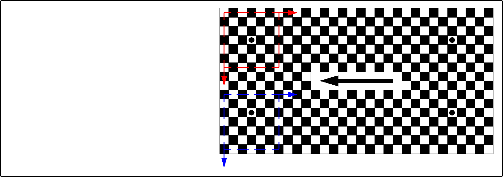
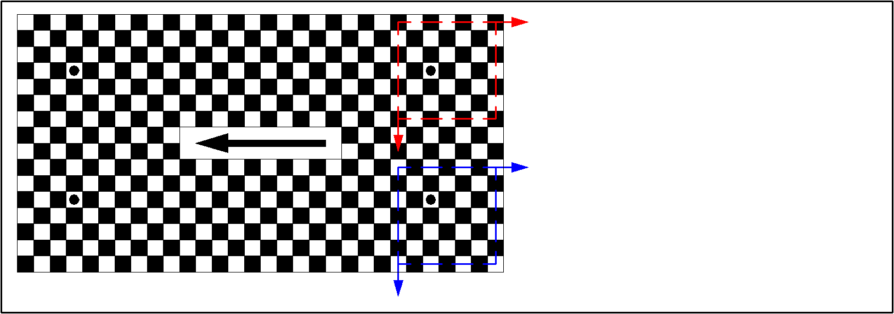
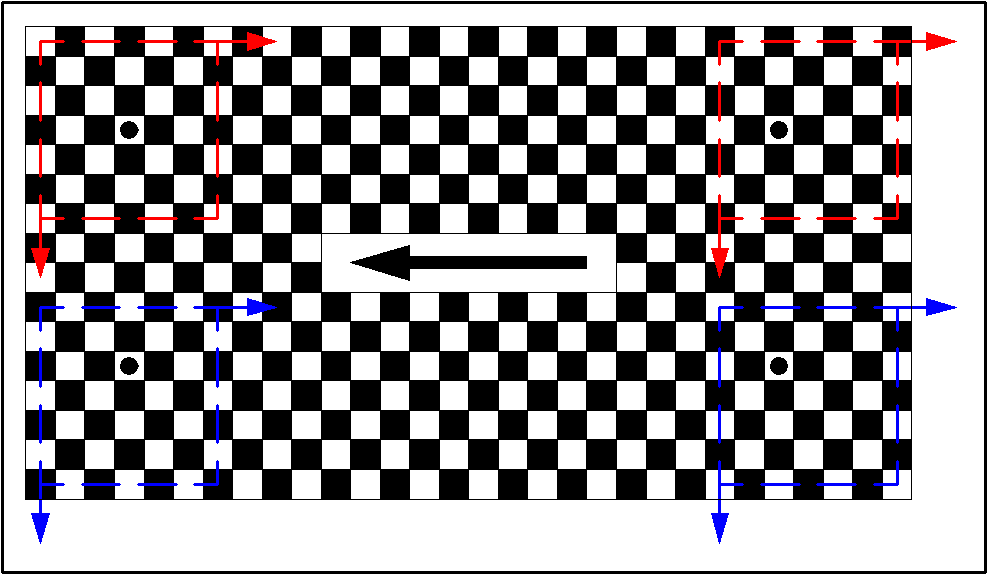
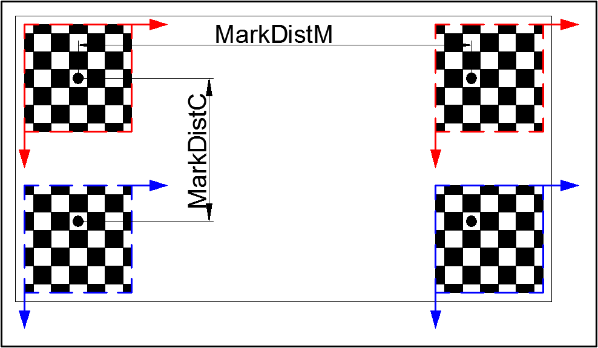
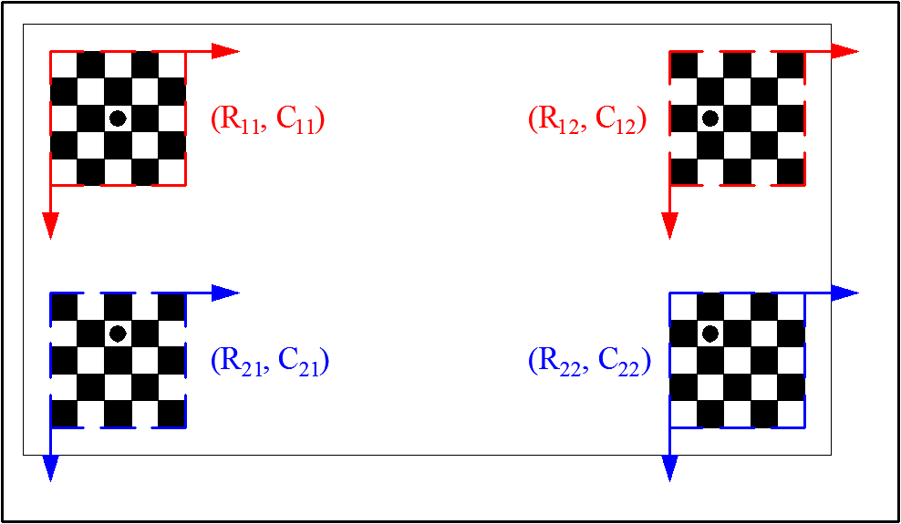
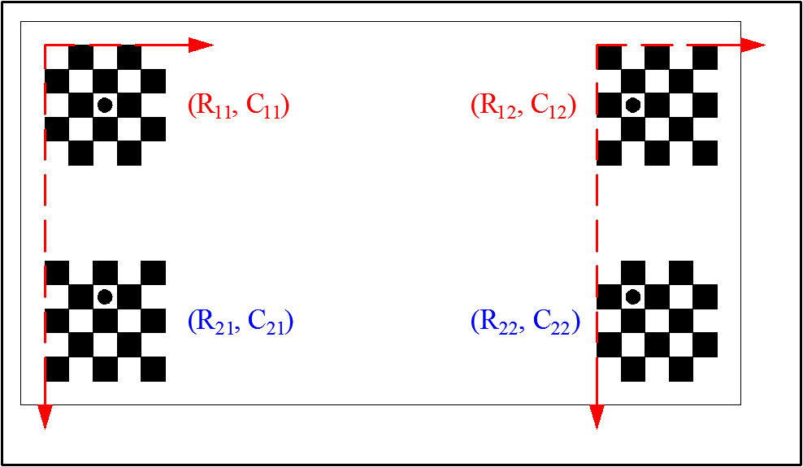
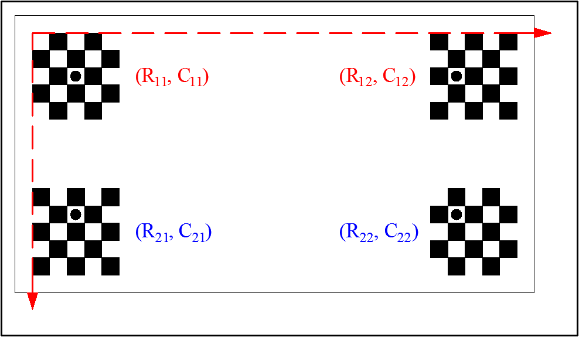

# Calibration Verification

1.  [We Have Done](#We-Have-Done)
2.  [Main Work](#Main-Work)
3.  [Temporary Plan](#Temporary-Plan)

## We Have Done

> We use two cameras (`CameraRed` and `CameraBlue`) to capture images of the four corners of the product, then we can locate the product based on the calibration plate coordinate system. 

- Step 1: Capture the images of the upper left (`Image11`) and lower left (`Image21`) corners of the calibration plate. 

	

- Step 2: Capture the image in the upper right (`Image12`) and lower right (`Image22`) corners of the calibration plate. 

	

- Step 3: The above two steps can be expressed as the following figure. 

	

- Step 4: The four images are shown as follow. The red and blue coordinate systems represent the respective image coordinate systems. We know the positional relationship of each mark on the actual calibration plate. 

	

- Step 5: Calibrate the images and extract the center coordinates of the mark points. 

	

- Step 6: Calculate the image relationship between two cameras. 

	

- Step 7: Calculate the image relationship between two image acquisition locations. 

	

- Step 8: According to the center coordinates and the positional relationship of each mark, the mosaic parameters between the four images can be calculated.

$$\Delta R_C = mean(R_{11}, R_{12}) - mean(R_{21}, R_{22}) + MarkDistC$$

$$\Delta C_C = mean(C_{11}, C_{12}) - mean(C_{21}, C_{22})$$

$$\Delta R_M = mean(R_{11}, R_{21}) - mean(R_{21}, R_{22})$$

$$\Delta C_C = mean(C_{11}, C_{21}) - mean(C_{21}, C_{22}) + MarkDistM$$

$$(R_{11}, C_{11}) := (R_{11}, C_{11})$$

$$(R_{21}, C_{21}) := (R_{21} + \Delta R_C, C_{21} + \Delta C_C)$$

$$(R_{12}, C_{12}) := (R_{12} + \Delta R_M, C_{12} + \Delta C_M)$$

$$(R_{22}, C_{22}) := (R_{22} + \Delta R_C + \Delta R_M, C_{22} + \Delta C_C + \Delta C_M)$$

- Step 9: According to the new coordinates of the mark points, we can verify whether the polygons formed by the four mark points are strictly rectangular (the side lengths are equal and the angles are right angle).
- Step 10: Change the position of the calibration plate and verify again. 
- Step 11: Change the acquisition locations of the cameras and verify again. 

## Main Work

1.  Build an experimental platform to achieve the overall verification process. 
2.  Compare the impact of different camera calibration methods on verification results. 
    1.  Checkerboard calibration: reference HALCON example `grid_rectification.hdev`
    2.  Zhengyou Zhang calibration method: [A Flexible New Technique for Camera Calibration](http://swardtoolbox.github.io/ref/Zhang.pdf)
3.  Compare the impact of different lenses on the verification results. 
    1.  Telecentric Lenses
    2.  Ordinary lens
4.  Compare the impact of different cameras on verification results.
    1.  Line camera
    2.  Area camera

## Temporary Plan

| Main Work | Duration (Week) |
| :-------: | :-------------: |
|     1     |        1        |
|     2     |        1        |
|     3     |        1        |
|     4     |        1        |

